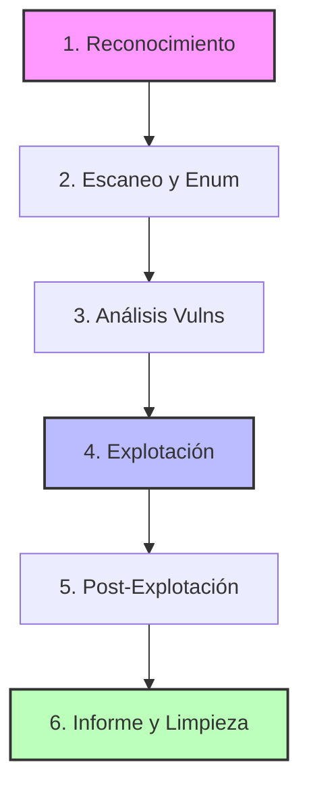

# 📑 Metodología de Pentesting (Paso a Paso)

> **Ciclo de vida estándar** de una prueba de penetración, desde el contacto inicial hasta el informe final.

---

## 📊 Flujo de Trabajo

```mermaid
graph TD
    A[1. Reconocimiento] --> B[2. Escaneo y Enum]
    B --> C[3. Análisis Vulns]
    C --> D[4. Explotación]
    D --> E[5. Post-Explotación]
    E --> F[6. Informe y Limpieza]
    
    style A fill:#f9f,stroke:#333,stroke-width:2px
    style D fill:#bbf,stroke:#333,stroke-width:2px
    style F fill:#bfb,stroke:#333,stroke-width:2px
```
